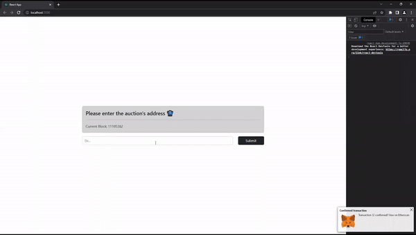

# SealedBidAuction
A sealed bid auction written in solidity for the ethereum blockchain. This is/was the final project for UVIC's Blockchain Technologies class.

## Using the Contract
Bidders can choose to use the web UI or directly interact with the contract, whereas auctioneers need to do the latter. A short demo where the bidder uses the frontend is avalaible below [here](https://www.youtube.com/watch?v=Nn9LJNpa-S8).

### Using the Frontend
Using the provided frontend bidders will be guided through a straightforward set of steps to successfully bid on the contract.
Not using the provided frontend requires bidders to do some steps manually that the frontend automates.

### Creating Commitments
Commitments should be generated using the following steps. Commitments are automactically generated by the frontend, but can be manually generated by following below steps.
1) Convert your bid and nonce into 256bit hex values
2) Concatenate them (bid first)
3) Hash the result using the keccak256 algorithm

For hashing manually you can use the [keccak256 online calculator](https://emn178.github.io/online-tools/keccak_256.html) (make sure to use hex mode).
Make sure to prepend `0x` to the result.

2 sample commitments are shown below.
> Bid = `55555 = 0xd903`  
> Nonce = `12345 = 0x3039`  
> Hex input to hash function = `000000000000000000000000000000000000000000000000000000000000d9030000000000000000000000000000000000000000000000000000000000003039`  
> Hash (commitment) = `"0xf84f89236fa930177ba1699ceffc6b034bf6f9c191493311d0bc589f37f082e3"`  
> Reveal data = `55555, 12345`  

> Bid = `55556 = 0xd904`  
> Nonce = `12345 = 0x3039`  
> Hex input to hash function = `000000000000000000000000000000000000000000000000000000000000d9040000000000000000000000000000000000000000000000000000000000003039`  
> Hash (commitment) = `"0x63c8febb3809fa6afd08d81c9973e539c5e5b866b02449547f51cc65972e4150"`  
> Reveal data = `55556, 12345`  

### Steps
1) Auctioneer calls the constructor, specifying the block numbers where the contract shall enter the reveal phase and end phase
2) Anyone but the auctioneer can now place bids by commiting with the `bid()` function
3) Wait for the reveal phase
4) Willing users now call `reveal()`, passing their bid and nonce and paying their bid
5) Wait for the end phase, reveals are now ignored when it comes to the bidding process (someone could technically reveal late then immediately withdraw but their bid will be ignored)
6) The highest bid gets locked and only the auctioneer can withdraw it
7) All loosing bidders can withdraw their funds by calling `withdraw()`

## Security
This contract is vulnerable to an attack where a malicious bidder can take advantage of the fact that bid value and nonce are simply contatenated for the commitment. 
Say their initial commit was `bid = 1111, Nonce = 2222`. This would give an input of `0000000000000000000000000000000000000000000000000000000000002b6700000000000000000000000000000000000000000000000000000000000056ce` and hash of `0x3939206b9394a592905623f929617a33875d7d63203d25463e2159f712bd8adc`.
During the reveal phase they could claim their bid was `2b = 43` and nonce `6700000000000000000000000000000000000000000000000000000000000056ce`. This still hashes to the same value.
This is not a serious attack though as they are still held to pay their revealed amount, and are simply able to somewhat alter their bid amount between the commitment and reveal phase. For the purposes of thisi project this is not a problem or a large vulnerability.

## Building the Frontend
The frontend is a react app which can be built and run using the commands below within the [/frontend/](/frontend/) directory. This will start a local
server hosting the frontend on port 3000.
1) `npm i`
2) `npm start`
